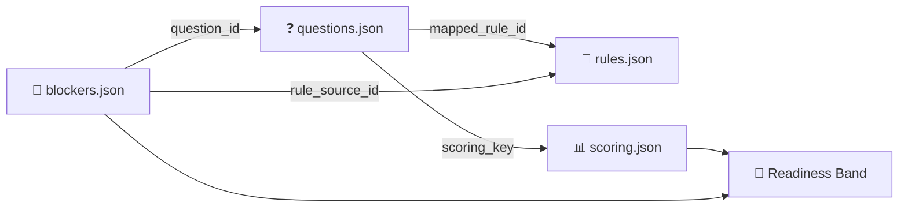

<div align="center">

# 🛂 ParchiVisa Data

**Structured student visa readiness data for Pakistani applicants, as questions, rules, blockers and scoring**


🇦🇺 Australia · 🇨🇦 Canada · 🇬🇧 United Kingdom · 🇺🇸 United States

</div>

---

## ✨ What is this?

**ParchiVisa Data** is the knowledge base behind ParchiVisa, a tool that checks how ready a student visa application is **before** it gets submitted.

Visa requirements live in long government web pages. This repo turns them into machine-readable JSON:

- ❓ **Questions** to ask the applicant, with input types, validation and conditional logic
- 📜 **Rules** taken from official immigration sources, each with a stable ID and source URL
- 🚫 **Blockers**, the answers that stop an application outright
- 📊 **Scoring** models that turn answers into a readiness band

> [!IMPORTANT]
> This dataset measures **documented readiness and risk exposure**. It does **not** predict a visa decision and it is **not legal advice**. Always check fees, fund amounts and policy details against the official government source before applying.

---

## 🌍 Coverage

| Country | Visa Route | Questions | Rules | Blockers | Currency |
|:--|:--|:--:|:--:|:--:|:--:|
| 🇦🇺 **Australia** | Student Visa (Subclass 500) | 58 | 15 | 21 | AUD |
| 🇨🇦 **Canada** | Study Permit | 65 | 20 | 15 | CAD |
| 🇬🇧 **UK** | Student Visa (formerly Tier 4 General) | 63 | 22 | 43 | GBP |
| 🇺🇸 **USA** | F-1 Student Visa | 55 | 17 | 38 | USD |
| | **Total** | **241** | **74** | **117** | |

All datasets were last verified on **2026-05-29**.

---

## 📁 Repository Structure

```text
parchivisa-data/
├── QUESTION_SCHEMA.md          # 📘 Authoritative schema reference (start here)
└── student/
    ├── index.json              # 🗂️  Registry of all country datasets
    ├── australia/
    │   ├── questions.json      # Questionnaire items
    │   ├── rules.json          # Official immigration rules
    │   ├── blockers.json       # Hard-stop conditions
    │   ├── scoring.json        # Categories, bands & evaluation model
    │   └── raw_research.md     # Source research notes
    ├── canada/
    ├── uk/
    └── usa/
        └── sources.json        # Source ID → URL lookup
```

---

## 🧩 How the pieces fit together



| File | Purpose | Key fields |
|:--|:--|:--|
| `questions.json` | What to ask and how to validate the answer | `id`, `input_type`, `validation`, `show_if`, `tier`, `score_impact` |
| `rules.json` | The immigration requirement being tested | `rule_id`, `rule_name`, `critical_blocker`, `source_url` |
| `blockers.json` | Answers that force the worst outcome | `blocker_id`, `trigger`, `user_message`, `recommended_next_step` |
| `scoring.json` | How answers turn into a score | `config`, `scoring_categories`, `score_bands`, `evaluation_model` |

---

## 📊 Scoring Model

Each country uses a **tiered weighted model with band caps**, so a high average can't hide a serious risk.

| Tier | Effect |
|:--|:--|
| 🔴 `hard` | Any triggered hard blocker forces **Critical Refusal Risk**, and scoring stops |
| 🟠 `high_risk` | Deducts points **and** caps the band (1–2 flags → High, 3+ → Critical) |
| 🟡 `soft` | Deducts points within the band, with no cap |
| ⚪ `info` | Routing only, with no pass or fail outcome |

**Readiness bands**

| Score | Band |
|:--:|:--|
| 85 – 100 | 🟢 Low Risk: appears well-prepared |
| 70 – 84 | 🟡 Moderate Risk: improve before submission |
| 50 – 69 | 🟠 High Refusal Risk |
| 0 – 49 | 🔴 Critical Refusal Risk |

```text
category_score = (Σ score_impact of passing questions / Σ score_impact of all scored questions) × max_points
total_score    = Σ category_score
final_band     = worse_of(score_band, high_risk_cap_band)
```

---

## 🔍 Example Question

```json
{
  "id": "uk_applicant_age",
  "country": "UK",
  "visa_route": "Student Visa (formerly Tier 4 General)",
  "section": "Profile",
  "question": "What is your age (in years)?",
  "input_type": "number",
  "validation": {
    "pass_if":    { "type": "gte", "value": 16 },
    "trigger_if": { "type": "lt",  "value": 16 }
  },
  "show_if": null,
  "mapped_rule_id": "uk_eligibility_minimum_age_requirement",
  "scoring_key": "documents",
  "risk_category": "Critical",
  "tier": "hard",
  "blocker_possible": true,
  "source_url": "https://www.gov.uk/student-visa",
  "last_verified": "2026-05-29"
}
```

---

## 🚀 Quick Start

Load the index and any country's dataset:

```js
import index from "./student/index.json" assert { type: "json" };

for (const c of index.countries) {
  const questions = await import(`./student/${c.questions_path}`, { assert: { type: "json" } });
  console.log(`${c.country}: ${questions.default.length} questions`);
}
```

```python
import json
from pathlib import Path

root = Path("student")
index = json.loads((root / "index.json").read_text(encoding="utf-8"))

for c in index["countries"]:
    questions = json.loads((root / c["questions_path"]).read_text(encoding="utf-8"))
    print(f'{c["country"]}: {len(questions)} questions')
```

---

## 📘 Schema

Every question follows the canonical schema in **[`QUESTION_SCHEMA.md`](QUESTION_SCHEMA.md)**. It covers:

- ✅ Required, conditional and optional fields
- 🎛️ All 12 supported `input_type` values
- 🧮 Validation, `show_if` logic and option formats
- 📅 Date (`YYYY-MM-DD`) and currency standards
- 👍 Good and 👎 bad examples
- 🧹 Cleanup checklist for adding new countries

---

## 🤝 Contributing

Want to add a country or update a rule?

1. Read [`QUESTION_SCHEMA.md`](QUESTION_SCHEMA.md) first.
2. Take every rule from an **official government source** and include its `source_url`.
3. Never invent a `mapped_rule_id` or a `last_verified` date. If you're not sure, set `needs_rule_confirmation: true`.
4. Scoring logic must use option **`value`s**, never display labels.
5. Register the new dataset in `student/index.json`.

---

## ⚠️ Disclaimer

This dataset is for **informational and readiness-assessment purposes only**. Immigration rules, fees and financial thresholds change often. ParchiVisa is not affiliated with any government or immigration authority, and nothing here is legal or immigration advice. Always check with the official source or a licensed advisor.

---

<div align="center">

Made with ❤️ for students in Pakistan 🇵🇰 who want to study abroad

</div>
